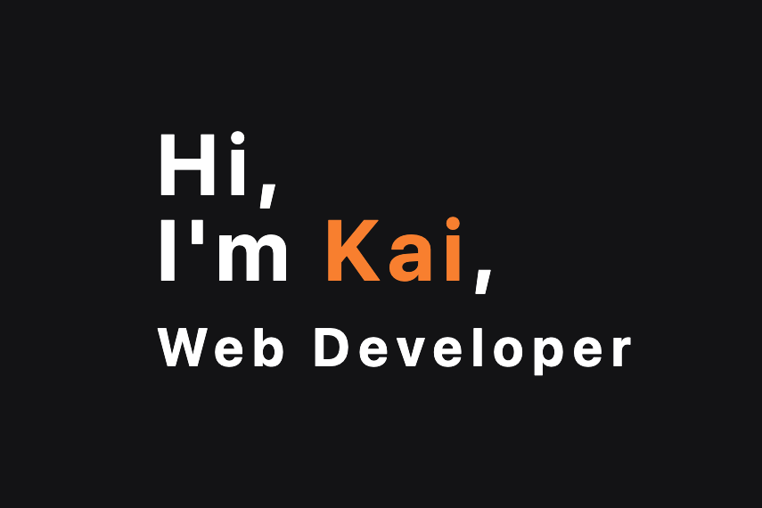

# Personal Portfolio

My Personal Portfolio website, showcasing my projects.



## Demo

Here is a working live demo: https://kapaha.github.io/personal-portfolio/

## Tech Stack

-   HTML
-   Tailwind CSS
-   Vite

## Setup & Installation

1. Clone the repository

    ```bash
    git clone git@github.com:kapaha/personal-portfolio.git
    cd personal-portfolio
    ```

2. Install dependencies

    ```bash
    npm ci
    ```

3. Run the development server
    ```bash
    npm run dev
    ```

## Building for Production

To create an optimized version of the app

```bash
npm run build
```

## Status

I will continue to update this portfolio to reflect my latest projects and will continue to improve on it as my knowledge of web development improves.
